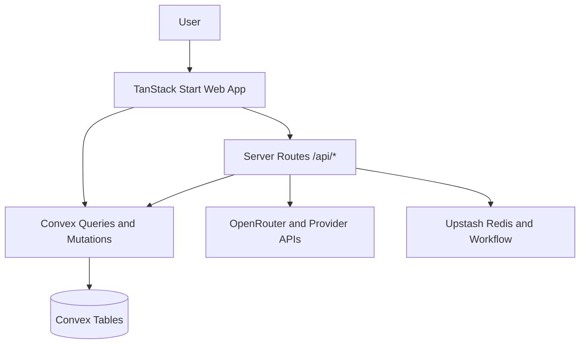

# Architecture

OpenChat is split into a UI/runtime layer (`apps/web`) and a realtime data/actions layer (`apps/server/convex`).

## Frontend Layer

- Routing via file routes in `apps/web/src/routes`.
- Chat UI in `chat-interface.tsx` with persistent lifecycle hooks.
- Sidebar + shortcuts wired from `__root.tsx` and `use-global-shortcuts.ts`.
- State via Zustand stores (`model`, `provider`, `openrouter`, `shortcuts`, `stream`).

## Server Route Layer

Server handlers in `apps/web/src/routes/api/*` provide:

- Model catalog proxy and cache (`api/models.ts`).
- Credential/key endpoints (`api/provider-credentials.ts`, `api/openrouter-key.ts`).
- Workflow endpoints for title generation, export, deletion, and cleanup (`api/workflow/*`).
- Typing indicator endpoint (`api/typing.ts`).

## Convex Layer

Primary tables include `users`, `profiles`, `userProviderCredentials`, `chats`, `messages`, `fileUploads`, `streamJobs`, `promptTemplates`, `chatReadStatus`, and `benchmarks`.

Core modules:

- `chats.ts`: list/create/remove/bulk remove/read state.
- `messages.ts`: send, stream upsert, edit/regenerate, retry.
- `streamExecution.ts`: provider resolution and stream orchestration.
- `users.ts` + `userApiKeys.ts`: profile + encrypted credentials.

## External Services

- Better Auth + GitHub OAuth for identity.
- OpenRouter and optional direct provider APIs.
- Upstash Redis for cache/rate limiting and Workflow for queued jobs.

## Reliability Patterns

- Ownership checks before read/write (`requireAuthUserId`, `assertOwnsChat`).
- Rate limits on sensitive API mutations and workflows.
- Background stream job resume support if client disconnects.
- Soft-delete strategy for chats/messages for safer data management.
