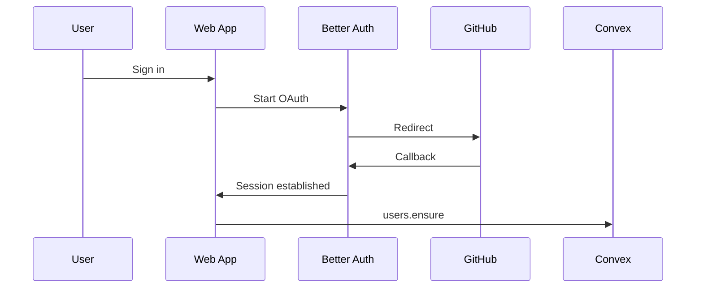

# Authentication

OpenChat uses Better Auth with GitHub OAuth, then syncs users into Convex.


## Request Flow



## Key Implementation Points

- Client auth state from `auth-client.tsx` via `useAuth()`.
- Server-side auth helpers in `server-auth.ts`.
- Root route preloads session in `routes/__root.tsx`.
- Route-level guards in pages such as `routes/c/$chatId.tsx` and `routes/settings.tsx`.

## Required Variables

```bash
GITHUB_CLIENT_ID=...
GITHUB_CLIENT_SECRET=...
BETTER_AUTH_SECRET=...
VITE_CONVEX_SITE_URL=...
```

<Warning>
  Callback URL must target the Convex site URL host: `/api/auth/callback/github`.
</Warning>

## Security Notes

- Same-origin checks are enforced on sensitive server handlers.
- Convex user identity is validated before database access.
- Rate limits protect auth-adjacent workflow endpoints.
